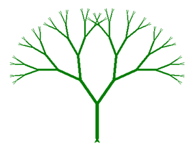

[](https://gitpod-redirect-0.herokuapp.com/)

# Exercices en vrac (chapitre 7)

## Objectifs

Compléter les quelques exercices suivants en modifiant le code de [exercice.py](exercice.py):

1. Un programme principal saisit une chaîne d'ADN valide et une séquence d'ADN valide (valide signifie qu'elles ne sont pas vides et sont formées exclusivement d'une combinaison arbitraire de "a", "t", "g" ou "c"). 
    
    a) Écrire une fonction valide qui renvoie vrai si la saisie est valide, faux sinon.
    
    b) Écrire une fonction saisie qui effectue une saisie valide et renvoie la valeur saisie sous forme d'une chaîne de caractères. Si la saisie n'est pas valide, on demande à l'utilisateur de recommencer.
    
    c) Écrire une fonction proportion qui reçoit deux arguments, la chaîne et la séquence et qui retourne la proportion de séquence dans la chaîne.

Le programme principal appelle la fonction saisie pour la chaîne et pour la séquence et affiche le résultat.

Exemple d’affichage:
```python
chaîne : attgcaatggtggtacatg
séquence : ca
Il y a 10.53 % de "ca".
```

2. En utilisant la librairie « Turtle », dessinez un arbre en utilisant la récursivité.
    Ressources : https://docs.python.org/3.3/library/turtle.html
   
    Dessin:
    
    Résultat final:
    

    Indices:
        - Remarquez comment l'arbre est dessiné
        - Remarquez que chaque branche est différente. On voit que plus on avance dans l'arbre
            - Plus la longueur des branches diminues
            - Plus l'épaisseur des branches diminues
            - Plus l'angle entre les branches diminues
        - Les fonctions de la librairie Turtle dont vous aurez besoin sont:
            - forward()
            - backward()
            - setheading()
            - color()
            - pensize()
            - right()
            - left()


